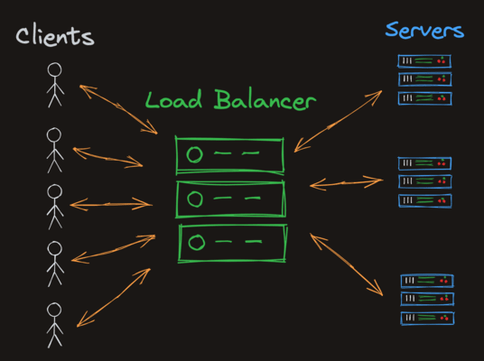

## Pulling From Docker

```shell
docker pull <image>
```


## Docker Process Status
```shell
docker ps <optional>
```
LIST OF COMMON optional
- -a -> all container (stopped + running)
- -q -> show only container IDs

## Docker Common Pattern
```shell
docker images ls
docker container ls
docker volume ls
docker network ls
```

## Running a Container

```shell
docker run -d -p <hostport>:<container-port> namespace/name:tag
```

- -d --> Run in detached mode (doesn't block your terminal)
- -p --> Publish a container's port to host (port forwarding)
- hostport -> Port on local machine
- container-port -> Port use inside container
- namespace/name -> the name of the image (usually in the format username/repo)
- tag: The version of the image (often `latest`)
### Example
```shell
docker run -d -p 8965:80 docker/getting-started:latest
```
```shell
docker run -d -e NODE_ENV=development -e url=http://localhost:3001 -p 3001:2368 -v ghost-vol:/var/lib/ghost ghost
```
- e --> enviroment variables
- v --> volume mounted


## Stopping a Container
- `docker stop`: This stops the container by issuing a SIGTERM signal to the container. You'll typically want to use docker stop.
- `docker kill`: This stops the container by issuing a SIGKILL signal to the container. This is a more forceful way to stop a container, and should be used as a last resort.
```shell
docker stop <container-id>
```

## Docker Volumes

### Creating Volume
```shell
docker volume create ghost-vol
```

### Inspecting Volume
```shell
docker volume ls // Checking all volumes
docker volume inspect ghost-vol // Checking specific volume
```

 ### Mounting Volume
 ```shell
docker run -d -e NODE_ENV=development -e url=http://localhost:3001 -p 3001:2368 -v ghost-vol:/var/lib/ghost ghost
 ```


## Docker Exec
```shell
docker exec <CONTAINER_ID> <command>
```

Example
```shell
docker exec 00ab7a141202 ls
```

### Exec Netstat
The netstat command shows us which programs are bound to which ports.
```shell
docker exec 00ab7a141202 netstat -ltnp
```

### Live Shell
```shell
docker exec -it CONTAINER_ID /bin/sh
```

- i --> makes `exec` command interactive
- t --> gives us a tty interace

## Network
```shell
docker run -d --network none docker/getting-started
```

- --network none -> stops the container from connecting to any external networks

### Custom Network
Creating Network
```shell
docker network create caddytest
```
### Load Balancer


Examples
- Create 2 Container with two --network none properties

```shell
docker run -d -p 8881:80 -v $PWD/index1.html:/usr/share/caddy/index.html caddy
docker run -d -p 8882:80 -v $PWD/index2.html:/usr/share/caddy/index.html caddy
```

- Create new network
```shell
docker network create caddytest
```

- Create another new container
```shell
docker run -it --network caddytest docker/getting-started /bin/sh
```

- Now inside your new container you can access previously (2) created container

```shell
curl caddy1
curl caddy2
```
- Confguring load balance (Candy)
```Candyfile
localhost:80

reverse_proxy caddy1:80 caddy2:80 {
	lb_policy       round_robin
}
```
This tells Caddy to run on `localhost:80`, and to round robin any incoming traffic to `caddy1:80 `and `caddy2:80`. Remember, this only works because we're going to run the loadbalancer on the same network, so `caddy1` and `caddy2` will automatically resolve to our application server's containers.

- Start Load balancer with port (-p)
```shell
docker run -d --network caddytest -p 8880:80 -v $PWD/Caddyfile:/etc/caddy/Caddyfile caddy
```
- Try `curl //localhost:8880/`
```shell
curl http://localhost:8880/
```
This will return response from either `candy1` or `candy2` based on their `round-robin` rotation

## Dockerfile
Examples
```docker
# This is a comment

# Use a lightweight debian os
# as the base image
FROM debian:stable-slim

# execute the 'echo "hello world"'
# command when the container runs
CMD ["echo", "hello world"]
```

more examples in `Dockerfile` and `Dockerfile.py`

### Building Docker Image
```shell
docker build . -t helloworld:latest -f
docker build . -t <namespace/name>:<tag/version> -f <Dockerfile> .
```
- -t --> tag
- -f --> specific Dockerfile name, example `Dockerfile.py`

### Runnng Docker Image
```shell
docker run helloworld
```

